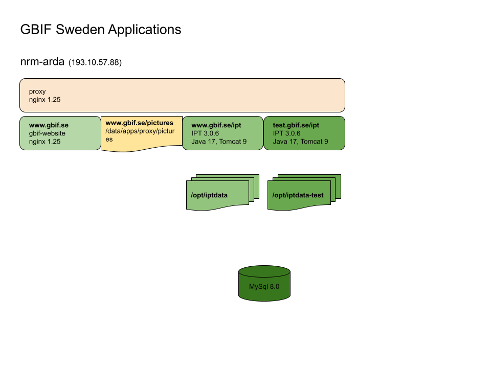

# Documentation overview

This document serves as a starting point for documentation of GBIF Sweden services and applications managed by NRM. 

## Hosting
- Servers are hosted at NRM by the IT department.
- The domain (gbif.se) is managed by the IT department.
- SSL/TLS Certificates are provided by Sectigo (through the IT department).
- Most applications run in [Docker](https://www.docker.com/).

### Application overview

## DevOps
Many devops tasks are automated using [Ansible](https://www.ansible.com/) and can be found, along with documentation, in the [gbif-install](https://github.com/GBIF-Sweden/gbif-install) repository.

### Regular maintenance
- [General](https://github.com/GBIF-Sweden/documentation-overview/wiki/General-maintenance)
